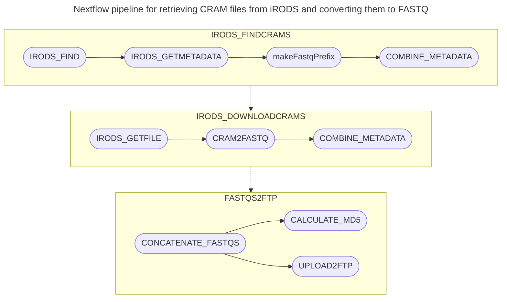

# nf-irods-to-fastq

## Overview

This Nextflow pipeline retrieves samples from iRODS storage, converts CRAM/BAM files to FASTQ format, and optionally uploads the results to FTP servers. The pipeline supports comprehensive metadata management and provides three main operations: metadata discovery, CRAM-to-FASTQ conversion, and FTP upload.

## Contents of Repo

* `main.nf` — the main Nextflow pipeline that orchestrates all workflows
* `nextflow.config` — configuration script for IBM LSF submission on Sanger's HPC with Singularity containers and global parameters
* `subworkflows/` — collection of subworkflows for different pipeline stages
* `modules/` — collection of reusable modules for various tasks
* `configs/` — configuration files for different pipeline components
* `examples/` — example input files demonstrating various input formats

## Pipeline Workflow

1. **Sample Discovery**: Reads sample information from CSV, TSV, or JSON input files
2. **Metadata Retrieval**: Searches iRODS for CRAM files associated with samples and retrieves metadata
3. **File Download**: Downloads CRAM/BAM files from iRODS storage
4. **Format Conversion**: Converts CRAM/BAM files to FASTQ format using samtools
5. **Quality Control**: Calculates read lengths and applies ATAC-seq specific formatting if needed
6. **File Concatenation**: Combines FASTQ files by sample and read type
7. **Checksum Calculation**: Generates MD5 checksums for data integrity verification
8. **FTP Upload**: Optionally uploads processed FASTQ files to specified FTP servers

## Pipeline Parameters

### Required Parameters (choose one):
* `--samples` — Path to a CSV, TSV, or JSON file containing sample information with a `sample` or `sample_id` column
* `--crams` — Path to a CSV or TSV file containing CRAM file information with columns: `sample`, `cram_path`, `fastq_prefix`
* `--fastqs` — Path to a CSV file containing FASTQ file information with columns: `sample`, `path`

### Operation Flags:
* `--cram2fastq` — Enable CRAM-to-FASTQ conversion (used with `--samples` or `--crams`)
* `--toftp` — Enable FTP upload (used with `--fastqs`)

### Optional Parameters:
* `--output_dir` — Output directory for pipeline results (default: `"results"`)
* `--publish_mode` — File publishing mode (default: `"copy"`)
* `--index_format` — Index format formula for samtools (default: `"i*i*"`)
* `--format_atac` — Apply ATAC-seq specific formatting (default: `true`)
* `--ignore_patterns` — Comma-separated patterns to ignore when finding CRAMs (default: `"*_phix.cram,*yhuman*,*#888.cram"`)
* `--irods_zone` — iRODS zone to search (default: `"seq"`)

### FTP Parameters (required when using `--toftp`):
* `--ftp_host` — FTP server hostname (default: `"ftp-private.ebi.ac.uk"`)
* `--username` — FTP username
* `--password` — FTP password
* `--ftp_path` — Target path on FTP server

Note: When using `--toftp`, you must also provide `--fastqs` with a CSV file containing FASTQ paths.

## Input File Formats

The pipeline supports multiple input formats for different operation modes:

### Option 1: Sample Discovery (`--samples`)

Specify `sample` or `sample_id` along with other useful metadata columns to find CRAM files on iRODS.

**CSV format:**
```csv
sample,study_title
4861STDY7135911,Study_Name
4861STDY7135912,Study_Name
Human_colon_16S8000511,Human_colon_16S
```

**TSV format:**
```tsv
sample	study_title
4861STDY7135911	Study_Name
4861STDY7135912	Study_Name
```

**JSON format:**
```json
[
  {"sample": "4861STDY7135911", "study_title": "Study_Name"},
  {"sample": "4861STDY7135912", "study_title": "Study_Name"}
]
```

### Option 2: Direct CRAM Processing (`--crams`)

Specify `sample`, `cram_path`, and `fastq_prefix` columns to directly process known CRAM files.

**CSV format:**
```csv
sample,cram_path,fastq_prefix
4861STDY7135911,/seq/24133/24133_1#4.cram,4861STDY7135911_S1_L001
4861STDY7135911,/seq/24133/24133_2#2.cram,4861STDY7135911_S1_L002
```

### Option 3: FASTQ Upload (`--fastqs`)

Specify `sample` and `path` columns for FASTQ files to upload. Note: this requires a CSV file, not a directory path.
```
sample,path
4861STDY7135911,results/fastqs/4861STDY7135911/4861STDY7135911_S1_L001_I1_001.fastq.gz
4861STDY7135911,results/fastqs/4861STDY7135911/4861STDY7135911_S1_L001_R1_001.fastq.gz
```

## Examples

### System Requirements Setup
Prepare your environment on Sanger's farm22:

```bash
module load cellgen/nextflow/24.10.0
module load cellgen/irods
module load cellgen/singularity
module load python-3.11.6
export LSB_DEFAULT_USERGROUP=<YOURGROUP>
```

Initialize iRODS connection:
```bash
iinit
```

### Basic Usage Examples

**1. Sample Metadata Discovery:**
```bash
nextflow run main.nf --samples ./examples/samples.csv
```

This generates a `metadata/` directory with:
```
metadata/
├── getmetadata.log     # warnings and processing information
└── metadata.tsv       # sample metadata from iRODS
```

**2. CRAM-to-FASTQ Conversion:**
```bash
nextflow run main.nf --cram2fastq --crams metadata/metadata.tsv
```

**3. Complete Pipeline (Discovery + Conversion):**
```bash
nextflow run main.nf --samples ./examples/samples.csv --cram2fastq
```

Note: The pipeline does not currently support end-to-end operation combining CRAM conversion with FTP upload in a single command. To upload converted FASTQ files, you must first run the conversion step, then use the generated `fastqs.csv` file for FTP upload in a separate command.

**4. FTP Upload:**
```bash
nextflow run main.nf --toftp --fastqs ./examples/fastqs.csv
```

**5. End-to-End Pipeline (two-step process):**
```bash
# Step 1: Discovery and conversion
nextflow run main.nf --samples ./examples/samples.csv --cram2fastq

# Step 2: Upload the generated fastqs.csv (after step 1 completes)
nextflow run main.nf --toftp --fastqs ./results/fastqs.csv
```

### Advanced Usage Examples

**Custom Output Directory:**
```bash
nextflow run main.nf \
    --samples ./examples/samples.csv \
    --cram2fastq \
    --output_dir "my_results"
```

**Disable ATAC Formatting:**
```bash
nextflow run main.nf \
    --samples ./examples/samples.csv \
    --cram2fastq \
    --format_atac false
```

## Expected Output Structure

### After Metadata Discovery:
```
metadata/
├── getmetadata.log
└── metadata.tsv
```

### After CRAM-to-FASTQ Conversion:
```
results/
├── fastqs/
│   └── {sample}/
│       ├── {sample}_S1_L001_I1_001.fastq.gz
│       ├── {sample}_S1_L001_R1_001.fastq.gz
│       ├── {sample}_S1_L001_R2_001.fastq.gz
│       └── ...
├── fastqs.csv                    # Generated CSV file listing all FASTQ paths
└── metadata_final.tsv            # Final metadata file
```

### After FTP Upload:
Additional files in `results/`:
```
├── concatenated/                  # Concatenated FASTQ files by sample
│   ├── {sample}_S1_I1_001.fastq.gz
│   ├── {sample}_S1_R1_001.fastq.gz
│   └── {sample}_S1_R2_001.fastq.gz
└── md5checksums.txt              # MD5 checksums of uploaded files
```

## System Requirements

- **Nextflow**: Version 25.04.4 or higher
- **Singularity**: For containerized execution
- **iRODS client**: Access to iRODS commands (`iget`, `imeta`, etc.)
- **LSF**: For job submission on HPC clusters (configured for Sanger's environment)

## Error Handling

- **Invalid input files**: Pipeline validates CSV/TSV headers and JSON structure
- **Missing samples**: Warnings are logged for samples not found in iRODS
- **Missing required fields**: Pipeline validates presence of required columns (`sample`/`sample_id`, `cram_path`, `fastq_prefix`)
- **Empty sample values**: Pipeline checks for non-empty sample identifiers
- **Checksum verification**: MD5 checksums are calculated for data integrity verification
- **FTP upload failures**: Failed uploads are logged with detailed error messages

## Monitoring and Logging

The pipeline generates comprehensive reports in the `reports/` directory:
- **Timeline report**: Visual timeline of task execution
- **Execution report**: Detailed resource usage and performance metrics
- **Trace file**: Complete execution trace for debugging

## Pipeline Flow Diagram



## Usage Notes

- Only one input mode can be used per pipeline run (`--samples`, `--crams`, OR `--fastqs`)
- When using `--samples`, the pipeline will automatically discover associated CRAM files in iRODS
- Sample names must contain either a `sample` or `sample_id` column in input files
- The pipeline automatically handles 10X ATAC-seq specific file naming conventions
- FASTQ files are concatenated by sample and read type for easier downstream processing
- FTP uploads require both `--toftp` flag AND `--fastqs` parameter with a CSV file (not directory)
- End-to-end processing (CRAM conversion + FTP upload) requires two separate pipeline runs
- Large CRAM files may take considerable time to download and convert depending on network bandwidth
- The pipeline is optimized for batch processing of multiple samples simultaneously
- The pipeline writes a `fastqs.csv` file to the output directory after CRAM conversion, which can be used for subsequent FTP uploads
