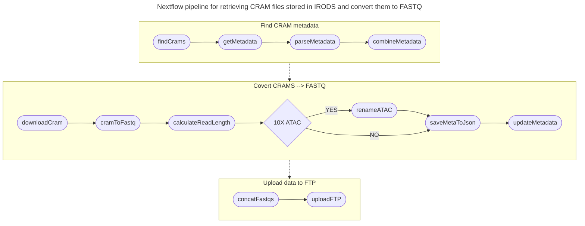

# nf-irods-to-fastq
This Nextflow pipeline pulls samples from iRODS and converts them to FASTQ files.

## Contents of Repo
* `main.nf` - the Nextflow pipeline that runs all workflows
* `modules/metatable.nf` - a collection of processes that help getting `IRODS` metadata for samples listed in `--findmeta <samples.csv>` file
* `modules/getfiles.nf` - a collection of processes that help loading the data (`.cram` or `.bam` files) from IRODS and converting them to `.fastq.gz` files
* `modules/upload2ftp.nf` - a collection of processes that help uploading a list of `.fastq.gz` files to FTP server (specified in `nextflow.config`)
* `nextflow.config` - the configuration script that controls the cluster scheduler, process and container
* `bin/parser.py` - script that parses metadata from `imeta ls` output and saves it in `.json` format
* `bin/combine_meta.py` - script that combines all metadata in `.json` format and saves it to `.tsv` file
* `examples/samples.csv` - an example samples.csv file, contains one colum with sample names (header 'sample' is required).
* `examples/run.sh` - an example run script that executes the pipeline.

## Pipeline Arguments
* `--findmeta`: specify a .csv file with sample names to run a metadata search
* `--cram2fastq`: if specified the script runs conversion of cram files that are found on `findmeta` step
* `--meta`: this argument spicifies the .tsv with cram files (potentially from `findmeta` step) to run cram2fastq conversion
* `--publish_dir`: path to put the output filess of the pipeline. (default `'results'`)
* `--index_format`: index-format formula for samtools, only if you really know what you're doing (default `"i*i*"`)
* `--toftp`: upload the resulting files to the ArrayExpress FTP server (default `false`).
  *   Use in combination with `--ftp_credenials`, `--ftp_host` and `--ftp_path`
*   `--fastqfiles`: this argument spicifies the .fastq.gz files (potentially from `cram2fastq` step) to upload them to the ArrayExpress ftp server

## Examples of use
1. Run a metadata search for a specified list of samples:
```shell
nextflow run main.nf --findmeta ./examples/samples.csv
```

2. Download cram files (specified in metadata.tsv) from IRODS and convert them to fastq
```shell
nextflow run main.nf --cram2fastq --meta metadata/metadata.tsv
```

3. Upload fastq files to ftp server (you to set up the ftp server in nextflow.config):
```shell
nextflow run main.nf --toftp --fastqfiles ./results/
```

4. Combine several steps to run them together
```shell
nextflow run main.nf --findmeta ./examples/samples.csv --cram2fastq --toftp
```

## Graph

